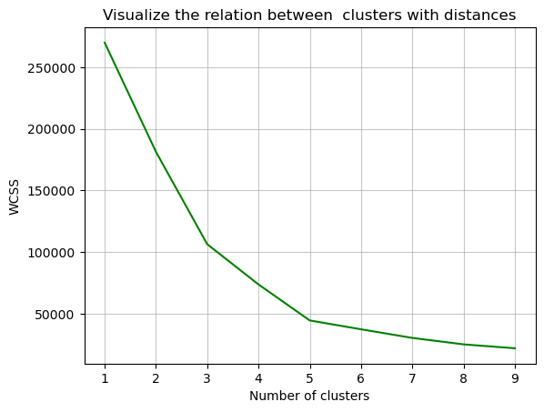
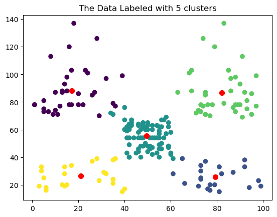

# Importing Libraries


```python
import numpy as np
import pandas as pd
import matplotlib.pyplot as plt
import seaborn as sns


from sklearn.cluster import KMeans   #Making Cluster
```

# Load & Exploring data


```python
data=pd.read_csv("Mall_Customers.csv")
```


```python
data
```


<div>
<style scoped>
    .dataframe tbody tr th:only-of-type {
        vertical-align: middle;
    }

    .dataframe tbody tr th {
        vertical-align: top;
    }

    .dataframe thead th {
        text-align: right;
    }
</style>
<table border="1" class="dataframe">
  <thead>
    <tr style="text-align: right;">
      <th></th>
      <th>CustomerID</th>
      <th>Gender</th>
      <th>Age</th>
      <th>Annual Income (k$)</th>
      <th>Spending Score (1-100)</th>
    </tr>
  </thead>
  <tbody>
    <tr>
      <th>0</th>
      <td>1</td>
      <td>Male</td>
      <td>19</td>
      <td>15</td>
      <td>39</td>
    </tr>
    <tr>
      <th>1</th>
      <td>2</td>
      <td>Male</td>
      <td>21</td>
      <td>15</td>
      <td>81</td>
    </tr>
    <tr>
      <th>2</th>
      <td>3</td>
      <td>Female</td>
      <td>20</td>
      <td>16</td>
      <td>6</td>
    </tr>
    <tr>
      <th>3</th>
      <td>4</td>
      <td>Female</td>
      <td>23</td>
      <td>16</td>
      <td>77</td>
    </tr>
    <tr>
      <th>4</th>
      <td>5</td>
      <td>Female</td>
      <td>31</td>
      <td>17</td>
      <td>40</td>
    </tr>
    <tr>
      <th>...</th>
      <td>...</td>
      <td>...</td>
      <td>...</td>
      <td>...</td>
      <td>...</td>
    </tr>
    <tr>
      <th>195</th>
      <td>196</td>
      <td>Female</td>
      <td>35</td>
      <td>120</td>
      <td>79</td>
    </tr>
    <tr>
      <th>196</th>
      <td>197</td>
      <td>Female</td>
      <td>45</td>
      <td>126</td>
      <td>28</td>
    </tr>
    <tr>
      <th>197</th>
      <td>198</td>
      <td>Male</td>
      <td>32</td>
      <td>126</td>
      <td>74</td>
    </tr>
    <tr>
      <th>198</th>
      <td>199</td>
      <td>Male</td>
      <td>32</td>
      <td>137</td>
      <td>18</td>
    </tr>
    <tr>
      <th>199</th>
      <td>200</td>
      <td>Male</td>
      <td>30</td>
      <td>137</td>
      <td>83</td>
    </tr>
  </tbody>
</table>
<p>200 rows × 5 columns</p>
</div>


```python
print(f'have any messing vlues ? \n{data.isna().values.any()}')
```

    have any messing vlues ? 
    False
    


```python
print(f'have any duplicated vlues ? \n{data.duplicated().values.any()}')
```

    have any duplicated vlues ? 
    False
    


```python
data.info()
```

    <class 'pandas.core.frame.DataFrame'>
    RangeIndex: 200 entries, 0 to 199
    Data columns (total 5 columns):
     #   Column                  Non-Null Count  Dtype 
    ---  ------                  --------------  ----- 
     0   CustomerID              200 non-null    int64 
     1   Gender                  200 non-null    object
     2   Age                     200 non-null    int64 
     3   Annual Income (k$)      200 non-null    int64 
     4   Spending Score (1-100)  200 non-null    int64 
    dtypes: int64(4), object(1)
    memory usage: 7.9+ KB
    


```python
x=data.iloc[: ,[-1,-2]].values
```


```python
print(x)
```

    [[ 39  15]
     [ 81  15]
     [  6  16]
     [ 77  16]
     [ 40  17]
     [ 76  17]
     [  6  18]
     [ 94  18]
     [  3  19]
     [ 72  19]
     [ 14  19]
     [ 99  19]
     [ 15  20]
     [ 77  20]
     [ 13  20]
     [ 79  20]
     [ 35  21]
     [ 66  21]
     [ 29  23]
     [ 98  23]
     [ 35  24]
     [ 73  24]
     [  5  25]
     [ 73  25]
     [ 14  28]
     [ 82  28]
     [ 32  28]
     [ 61  28]
     [ 31  29]
     [ 87  29]
     [  4  30]
     [ 73  30]
     [  4  33]
     [ 92  33]
     [ 14  33]
     [ 81  33]
     [ 17  34]
     [ 73  34]
     [ 26  37]
     [ 75  37]
     [ 35  38]
     [ 92  38]
     [ 36  39]
     [ 61  39]
     [ 28  39]
     [ 65  39]
     [ 55  40]
     [ 47  40]
     [ 42  40]
     [ 42  40]
     [ 52  42]
     [ 60  42]
     [ 54  43]
     [ 60  43]
     [ 45  43]
     [ 41  43]
     [ 50  44]
     [ 46  44]
     [ 51  46]
     [ 46  46]
     [ 56  46]
     [ 55  46]
     [ 52  47]
     [ 59  47]
     [ 51  48]
     [ 59  48]
     [ 50  48]
     [ 48  48]
     [ 59  48]
     [ 47  48]
     [ 55  49]
     [ 42  49]
     [ 49  50]
     [ 56  50]
     [ 47  54]
     [ 54  54]
     [ 53  54]
     [ 48  54]
     [ 52  54]
     [ 42  54]
     [ 51  54]
     [ 55  54]
     [ 41  54]
     [ 44  54]
     [ 57  54]
     [ 46  54]
     [ 58  57]
     [ 55  57]
     [ 60  58]
     [ 46  58]
     [ 55  59]
     [ 41  59]
     [ 49  60]
     [ 40  60]
     [ 42  60]
     [ 52  60]
     [ 47  60]
     [ 50  60]
     [ 42  61]
     [ 49  61]
     [ 41  62]
     [ 48  62]
     [ 59  62]
     [ 55  62]
     [ 56  62]
     [ 42  62]
     [ 50  63]
     [ 46  63]
     [ 43  63]
     [ 48  63]
     [ 52  63]
     [ 54  63]
     [ 42  64]
     [ 46  64]
     [ 48  65]
     [ 50  65]
     [ 43  65]
     [ 59  65]
     [ 43  67]
     [ 57  67]
     [ 56  67]
     [ 40  67]
     [ 58  69]
     [ 91  69]
     [ 29  70]
     [ 77  70]
     [ 35  71]
     [ 95  71]
     [ 11  71]
     [ 75  71]
     [  9  71]
     [ 75  71]
     [ 34  72]
     [ 71  72]
     [  5  73]
     [ 88  73]
     [  7  73]
     [ 73  73]
     [ 10  74]
     [ 72  74]
     [  5  75]
     [ 93  75]
     [ 40  76]
     [ 87  76]
     [ 12  77]
     [ 97  77]
     [ 36  77]
     [ 74  77]
     [ 22  78]
     [ 90  78]
     [ 17  78]
     [ 88  78]
     [ 20  78]
     [ 76  78]
     [ 16  78]
     [ 89  78]
     [  1  78]
     [ 78  78]
     [  1  78]
     [ 73  78]
     [ 35  79]
     [ 83  79]
     [  5  81]
     [ 93  81]
     [ 26  85]
     [ 75  85]
     [ 20  86]
     [ 95  86]
     [ 27  87]
     [ 63  87]
     [ 13  87]
     [ 75  87]
     [ 10  87]
     [ 92  87]
     [ 13  88]
     [ 86  88]
     [ 15  88]
     [ 69  88]
     [ 14  93]
     [ 90  93]
     [ 32  97]
     [ 86  97]
     [ 15  98]
     [ 88  98]
     [ 39  99]
     [ 97  99]
     [ 24 101]
     [ 68 101]
     [ 17 103]
     [ 85 103]
     [ 23 103]
     [ 69 103]
     [  8 113]
     [ 91 113]
     [ 16 120]
     [ 79 120]
     [ 28 126]
     [ 74 126]
     [ 18 137]
     [ 83 137]]
    

# WCSS ->Within Cluster Sum of Square

To Knowing the best number of clusters


```python
wcss = []

for i in range(1,10):
    kmeans_model = KMeans(n_clusters=i , init='k-means++') # Creating cluster model
    kmeans_model.fit(x) # fitting data and making the clusters
    
    
    wcss.append(kmeans_model.inertia_) # save the distance in the list
```

    C:\Users\motal\anaconda3\Lib\site-packages\sklearn\cluster\_kmeans.py:1412: FutureWarning: The default value of `n_init` will change from 10 to 'auto' in 1.4. Set the value of `n_init` explicitly to suppress the warning
      super()._check_params_vs_input(X, default_n_init=10)
    C:\Users\motal\anaconda3\Lib\site-packages\sklearn\cluster\_kmeans.py:1436: UserWarning: KMeans is known to have a memory leak on Windows with MKL, when there are less chunks than available threads. You can avoid it by setting the environment variable OMP_NUM_THREADS=1.
      warnings.warn(
    C:\Users\motal\anaconda3\Lib\site-packages\sklearn\cluster\_kmeans.py:1412: FutureWarning: The default value of `n_init` will change from 10 to 'auto' in 1.4. Set the value of `n_init` explicitly to suppress the warning
      super()._check_params_vs_input(X, default_n_init=10)
    C:\Users\motal\anaconda3\Lib\site-packages\sklearn\cluster\_kmeans.py:1436: UserWarning: KMeans is known to have a memory leak on Windows with MKL, when there are less chunks than available threads. You can avoid it by setting the environment variable OMP_NUM_THREADS=1.
      warnings.warn(
    C:\Users\motal\anaconda3\Lib\site-packages\sklearn\cluster\_kmeans.py:1412: FutureWarning: The default value of `n_init` will change from 10 to 'auto' in 1.4. Set the value of `n_init` explicitly to suppress the warning
      super()._check_params_vs_input(X, default_n_init=10)
    C:\Users\motal\anaconda3\Lib\site-packages\sklearn\cluster\_kmeans.py:1436: UserWarning: KMeans is known to have a memory leak on Windows with MKL, when there are less chunks than available threads. You can avoid it by setting the environment variable OMP_NUM_THREADS=1.
      warnings.warn(
    C:\Users\motal\anaconda3\Lib\site-packages\sklearn\cluster\_kmeans.py:1412: FutureWarning: The default value of `n_init` will change from 10 to 'auto' in 1.4. Set the value of `n_init` explicitly to suppress the warning
      super()._check_params_vs_input(X, default_n_init=10)
    C:\Users\motal\anaconda3\Lib\site-packages\sklearn\cluster\_kmeans.py:1436: UserWarning: KMeans is known to have a memory leak on Windows with MKL, when there are less chunks than available threads. You can avoid it by setting the environment variable OMP_NUM_THREADS=1.
      warnings.warn(
    C:\Users\motal\anaconda3\Lib\site-packages\sklearn\cluster\_kmeans.py:1412: FutureWarning: The default value of `n_init` will change from 10 to 'auto' in 1.4. Set the value of `n_init` explicitly to suppress the warning
      super()._check_params_vs_input(X, default_n_init=10)
    C:\Users\motal\anaconda3\Lib\site-packages\sklearn\cluster\_kmeans.py:1436: UserWarning: KMeans is known to have a memory leak on Windows with MKL, when there are less chunks than available threads. You can avoid it by setting the environment variable OMP_NUM_THREADS=1.
      warnings.warn(
    C:\Users\motal\anaconda3\Lib\site-packages\sklearn\cluster\_kmeans.py:1412: FutureWarning: The default value of `n_init` will change from 10 to 'auto' in 1.4. Set the value of `n_init` explicitly to suppress the warning
      super()._check_params_vs_input(X, default_n_init=10)
    C:\Users\motal\anaconda3\Lib\site-packages\sklearn\cluster\_kmeans.py:1436: UserWarning: KMeans is known to have a memory leak on Windows with MKL, when there are less chunks than available threads. You can avoid it by setting the environment variable OMP_NUM_THREADS=1.
      warnings.warn(
    C:\Users\motal\anaconda3\Lib\site-packages\sklearn\cluster\_kmeans.py:1412: FutureWarning: The default value of `n_init` will change from 10 to 'auto' in 1.4. Set the value of `n_init` explicitly to suppress the warning
      super()._check_params_vs_input(X, default_n_init=10)
    C:\Users\motal\anaconda3\Lib\site-packages\sklearn\cluster\_kmeans.py:1436: UserWarning: KMeans is known to have a memory leak on Windows with MKL, when there are less chunks than available threads. You can avoid it by setting the environment variable OMP_NUM_THREADS=1.
      warnings.warn(
    C:\Users\motal\anaconda3\Lib\site-packages\sklearn\cluster\_kmeans.py:1412: FutureWarning: The default value of `n_init` will change from 10 to 'auto' in 1.4. Set the value of `n_init` explicitly to suppress the warning
      super()._check_params_vs_input(X, default_n_init=10)
    C:\Users\motal\anaconda3\Lib\site-packages\sklearn\cluster\_kmeans.py:1436: UserWarning: KMeans is known to have a memory leak on Windows with MKL, when there are less chunks than available threads. You can avoid it by setting the environment variable OMP_NUM_THREADS=1.
      warnings.warn(
    C:\Users\motal\anaconda3\Lib\site-packages\sklearn\cluster\_kmeans.py:1412: FutureWarning: The default value of `n_init` will change from 10 to 'auto' in 1.4. Set the value of `n_init` explicitly to suppress the warning
      super()._check_params_vs_input(X, default_n_init=10)
    C:\Users\motal\anaconda3\Lib\site-packages\sklearn\cluster\_kmeans.py:1436: UserWarning: KMeans is known to have a memory leak on Windows with MKL, when there are less chunks than available threads. You can avoid it by setting the environment variable OMP_NUM_THREADS=1.
      warnings.warn(
    


```python
print(f'The distcnce for each cluster: \n {wcss}')
```

    The distcnce for each cluster: 
     [269981.28, 181363.59595959593, 106348.37306211118, 73679.78903948836, 44448.45544793371, 37271.8862365895, 30259.65720728547, 25031.418952745145, 21862.092672182887]
    

# Visualize the relation between  clusters with distances

# Elbow Method


```python
plt.plot(range(1,10) , wcss , color='g')
plt.title("Visualize the relation between  clusters with distances")
plt.xlabel("Number of clusters")
plt.ylabel("WCSS")
plt.grid(alpha=0.7)
plt.show()
```


    

    


Best Number of clusters are {3,5}

# Training Model

with 3 clusters


```python
KMeans_model = KMeans(n_clusters=3 , init="k-means++")

# Return a labels of data
y = KMeans_model.fit_predict(x)
print(y)
```

    C:\Users\motal\anaconda3\Lib\site-packages\sklearn\cluster\_kmeans.py:1412: FutureWarning: The default value of `n_init` will change from 10 to 'auto' in 1.4. Set the value of `n_init` explicitly to suppress the warning
      super()._check_params_vs_input(X, default_n_init=10)
    C:\Users\motal\anaconda3\Lib\site-packages\sklearn\cluster\_kmeans.py:1436: UserWarning: KMeans is known to have a memory leak on Windows with MKL, when there are less chunks than available threads. You can avoid it by setting the environment variable OMP_NUM_THREADS=1.
      warnings.warn(
    

    [2 2 2 2 2 2 2 2 2 2 2 2 2 2 2 2 2 2 2 2 2 2 2 2 2 2 2 2 2 2 2 2 2 2 2 2 2
     2 2 2 2 2 2 2 2 2 2 2 2 2 2 2 2 2 2 2 2 2 2 2 2 2 2 2 2 2 2 2 2 2 2 2 2 2
     2 2 2 2 2 2 2 2 2 2 2 2 2 2 2 2 2 2 2 2 2 2 2 2 2 2 2 2 2 2 2 2 2 2 2 2 2
     2 2 2 2 2 2 2 2 2 2 2 2 0 1 0 1 0 1 0 1 0 1 0 1 0 1 0 1 0 1 0 1 0 1 0 1 0
     1 0 1 0 1 0 1 0 1 0 1 0 1 0 1 0 1 0 1 0 1 0 1 0 1 0 1 0 1 0 1 0 1 0 1 0 1
     0 1 0 1 0 1 0 1 0 1 0 1 0 1 0]
    


```python
plt.scatter(x[: ,0] , x[: ,1] , c=KMeans_model.labels_)
plt.scatter(KMeans_model.cluster_centers_[: , 0] ,KMeans_model.cluster_centers_[: , 1]  , s=50 , c='r')
plt.title("The Data Labeled with 3 clusters")
plt.show()
```


    

    


# Using 5 Clusters


```python
KMeans_model2 = KMeans(n_clusters=5 , init="k-means++")

# Return a labels of data
y = KMeans_model2.fit_predict(x)
print(y)
```

    C:\Users\motal\anaconda3\Lib\site-packages\sklearn\cluster\_kmeans.py:1412: FutureWarning: The default value of `n_init` will change from 10 to 'auto' in 1.4. Set the value of `n_init` explicitly to suppress the warning
      super()._check_params_vs_input(X, default_n_init=10)
    C:\Users\motal\anaconda3\Lib\site-packages\sklearn\cluster\_kmeans.py:1436: UserWarning: KMeans is known to have a memory leak on Windows with MKL, when there are less chunks than available threads. You can avoid it by setting the environment variable OMP_NUM_THREADS=1.
      warnings.warn(
    

    [4 1 4 1 4 1 4 1 4 1 4 1 4 1 4 1 4 1 4 1 4 1 4 1 4 1 4 1 4 1 4 1 4 1 4 1 4
     1 4 1 4 1 4 2 4 1 2 2 2 2 2 2 2 2 2 2 2 2 2 2 2 2 2 2 2 2 2 2 2 2 2 2 2 2
     2 2 2 2 2 2 2 2 2 2 2 2 2 2 2 2 2 2 2 2 2 2 2 2 2 2 2 2 2 2 2 2 2 2 2 2 2
     2 2 2 2 2 2 2 2 2 2 2 2 3 0 3 2 3 0 3 0 3 2 3 0 3 0 3 0 3 0 3 2 3 0 3 0 3
     0 3 0 3 0 3 0 3 0 3 0 3 0 3 0 3 0 3 0 3 0 3 0 3 0 3 0 3 0 3 0 3 0 3 0 3 0
     3 0 3 0 3 0 3 0 3 0 3 0 3 0 3]
    


```python
plt.scatter(x[: ,0] , x[: ,1] , c=KMeans_model2.labels_)
plt.scatter(KMeans_model2.cluster_centers_[: , 0] ,KMeans_model2.cluster_centers_[: , 1]  , s=50 , c='r')
plt.title("The Data Labeled with 5 clusters")
plt.show()
```


    

    


----------------------------------------------------------------------------------------------------
